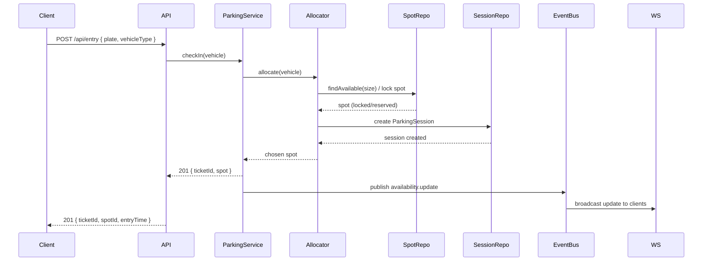
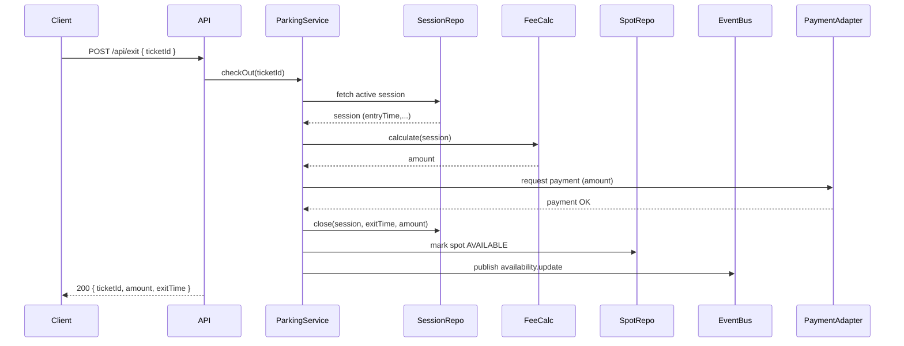
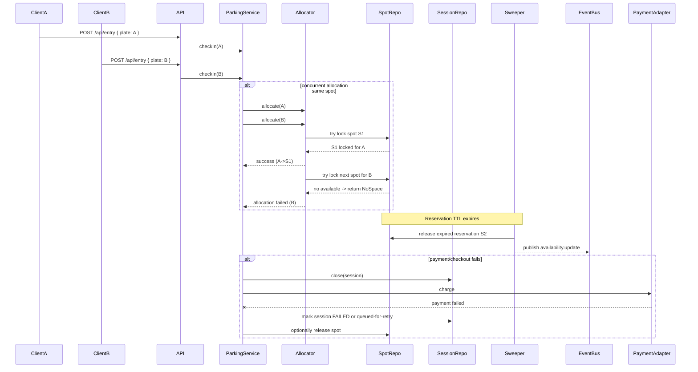

# Parking Lot System — Low-Level Design ✅🔧

**Summary:** Design a SOLID, testable backend for a smart parking lot that handles entry/exit, spot allocation, real-time availability, and fee calculation. This is a design doc (no DB wiring required) covering data model, APIs, algorithms, concurrency, and extensibility.

---

## 1) Goals & Constraints 🎯

- **Functional:** allocate spots by vehicle size, record entry/exit, calculate fees, update availability in real time.
- **Non-functional:** correctness under concurrency, low-latency allocation, extensible (new vehicle types, fee policies), observable and testable.
- **Assumptions:** floors organized into rows/lanes, spot sizes enum `{MOTORCYCLE, COMPACT, REGULAR, LARGE, BUS}`, payment handled externally (we return fee), billing rules configurable.

---

## 2) Domain Model (Entities) 📦

- **ParkingLot** (id, name, location)
- **Floor** (id, parking_lot_id, level)
- **ParkingSpot** (id, floor_id, code, size, status {AVAILABLE, OCCUPIED, RESERVED}, distance_rank)
- **Vehicle** (id, plate_number, type)
- **ParkingSession / Ticket** (id, vehicle_id, spot_id, entry_time, exit_time, status, billed_amount, version)
- **Rate** (id, vehicle_type, base_amount, per_hour, grace_period_minutes)
- **PaymentTransaction** (id, session_id, amount, paid_at, status)

> Relational model: `parking_spot` -> `floor`, `parking_session` -> `spot` & `vehicle`.

---

## 3) Database Schema (Representative SQL) 💾

```sql
CREATE TABLE vehicle_type (
  id SERIAL PRIMARY KEY,
  name TEXT UNIQUE
);

CREATE TABLE parking_spot (
  id BIGSERIAL PRIMARY KEY,
  floor_id BIGINT NOT NULL,
  code TEXT NOT NULL,
  size TEXT NOT NULL, -- same as vehicle_type
  status TEXT NOT NULL DEFAULT 'AVAILABLE', -- AVAILABLE|OCCUPIED|RESERVED
  distance_rank INT NOT NULL,
  CONSTRAINT uq_floor_code UNIQUE (floor_id, code)
);

CREATE TABLE vehicle (
  id BIGSERIAL PRIMARY KEY,
  plate VARCHAR(20) UNIQUE NOT NULL,
  type TEXT NOT NULL
);

CREATE TABLE parking_session (
  id BIGSERIAL PRIMARY KEY,
  vehicle_id BIGINT REFERENCES vehicle(id),
  spot_id BIGINT REFERENCES parking_spot(id),
  entry_time TIMESTAMP NOT NULL,
  exit_time TIMESTAMP,
  billed_amount DECIMAL(10,2),
  status TEXT NOT NULL, -- ACTIVE|CLOSED|CANCELLED
  version INT DEFAULT 0 -- optimistic locking
);

CREATE TABLE rate (
  id BIGSERIAL PRIMARY KEY,
  vehicle_type TEXT NOT NULL,
  base_amount DECIMAL,
  per_hour DECIMAL,
  grace_period_minutes INT
);
```

**Indexes:** `parking_spot (status, size, distance_rank)`, `parking_session (status, vehicle_id)`.

**Additional DB tables:**
```sql
CREATE TABLE parking_lot (
  id BIGSERIAL PRIMARY KEY,
  name TEXT NOT NULL,
  location TEXT
);

CREATE TABLE floor (
  id BIGSERIAL PRIMARY KEY,
  parking_lot_id BIGINT REFERENCES parking_lot(id),
  level INT NOT NULL
);

CREATE TABLE parking_reservation (
  id BIGSERIAL PRIMARY KEY,
  spot_id BIGINT REFERENCES parking_spot(id),
  reserved_by TEXT,
  reserved_until TIMESTAMP WITH TIME ZONE NOT NULL,
  created_at TIMESTAMP WITH TIME ZONE NOT NULL DEFAULT now()
);

CREATE TABLE payment_transaction (
  id BIGSERIAL PRIMARY KEY,
  session_id BIGSERIAL REFERENCES parking_session(id),
  amount DECIMAL(10,2) NOT NULL,
  paid_at TIMESTAMP WITH TIME ZONE,
  status TEXT NOT NULL
);
```

---

## 4) Spot Allocation Algorithm 🔍

**Goals:** assign the fastest available suitable spot, prefer closest, support contiguous allocation for buses.

**Data structures:**
- For each spot size: an ordered set (min-heap / priority queue) keyed by `distance_rank` of `AVAILABLE` spots.
- For buses: per-lane bitmaps or interval trees to find contiguous segments.

**Algorithm (simple & robust):**
1. Map vehicle -> compatible spot sizes (vehicle may fit in larger spots).
2. Try smallest-compatible size: fetch first AVAILABLE spot from priority queue.
3. Reserve with atomic operation: DB transaction + `SELECT ... FOR UPDATE` on chosen spot row or optimistic lock.
4. Create `ParkingSession`, mark spot `RESERVED` -> `OCCUPIED` on commit.

**Complexity:** O(log N) per lookup; contiguous search for buses typically O(K) where K is lane length.

---

## 5) Fee Calculation Logic 🧾 (Strategy Pattern)

- Expose `IFeeCalculator` and implement `FlatPerHourCalculator`, `TieredCalculator`, etc.
- Example formula: `totalHours = ceil((exit_time - entry_time - free_minutes)/60)` then `amount = base + totalHours * per_hour`.
- Store rate data in `rate` table and keep calculaters pluggable.

---

## 6) Concurrency & Consistency 🔐

- Use DB row-level locking during allocation (`SELECT ... FOR UPDATE`) to prevent double allocation.
- Optionally: distributed lock (Redis/RedLock) for higher-level coordination.
- Use optimistic locking (version) on `ParkingSession` updates.
- For high bursts: front-door queuing (Kafka/RabbitMQ) to serialize allocation attempts.
- Ensure idempotency by checking plate + active session before creating a new session.

---

## 7) APIs (REST examples) 🌐

- `POST /api/entry` -> { plate, vehicleType, preferred_floor? } -> 201 `{ ticketId, spot, entryTime }`
- `POST /api/exit` -> { ticketId } -> 200 `{ ticketId, entryTime, exitTime, amount }`
- `GET /api/spots/availability` -> `{ total, available, bySize }`
- `GET /api/sessions/{ticketId}` -> full session

**Realtime:** WebSocket / SSE at `/ws/availability` for push updates.

---

## 8) SOLID & Class Design (Interfaces + Implementations) 🧩

**Key interfaces**
- `IParkingSpotAllocator { allocate(vehicle): ParkingSpot | throws NoSpace }`
- `IFeeCalculator { calculate(session): Money }`
- `IParkingSessionRepository { create(session), close(session) }`
- `IParkingSpotRepository { findAvailableBySize(size), markReserved(spot), markAvailable(spot) }`

**Notes:**
- `SimpleAllocator` implements `IParkingSpotAllocator` (single responsibility).
- `FeeCalculatorFactory` returns `IFeeCalculator` for type (open to new strategies).
- `ParkingService` depends on abstractions (dependency injection).

**SOLID mapping:** SRP, OCP, LSP, ISP, DIP followed.

---

## 9) Flow Diagrams (Summary) 🔁

**Entry flow:**
1. API `/entry` receives request.
2. Validate vehicle; check active session.
3. Call `IParkingSpotAllocator.allocate(vehicle)`.
4. In transaction: `SELECT FOR UPDATE` and mark spot `RESERVED`.
5. Create `ParkingSession` (ACTIVE).
6. Emit `availability.update` event.

**Exit flow:**
1. `/exit` receives ticket.
2. Compute fee via `IFeeCalculator`.
3. Mark session CLOSED, spot -> AVAILABLE (transactional).
4. Emit `availability.update`.

---

## 10) Real-time Availability & Events 🔄

- Use Redis Pub/Sub or Kafka for events: `availability.update`, `session.created`, `session.closed`.
- WebSocket gateway subscribes and forwards to clients.
- Cache availability in Redis for fast reads.

---

## 11) Monitoring, Testing, & Observability 📊

- **Metrics:** allocation latency, success rate, occupancy per floor, queue length.
- **Logs:** structured logs with `correlationId`.
- **Tracing:** distributed tracing for entry/exit flows.
- **Tests:** unit (allocators, calculators), integration (DB transactions, concurrency), load tests for contention.

**Security & Timezone (Operational notes):**
- Timezone policy: store all timestamps in UTC (`TIMESTAMP WITH TIME ZONE`) and perform client-side conversion; include timezone info in logs and traces.
- API Security: protect APIs with authentication (JWT or API keys) and RBAC for admin operations; validate inputs and use idempotency tokens for entry/exit to prevent duplicate processing.
- Audit trail: maintain immutable audit logs for session/reservation changes (entry, exit, reservation, cancellation) for forensic needs.

---

## 12) Edge Cases & Tradeoffs ⚠️

- Simultaneous arrivals: handled via DB locks or queueing.
- Lost ticket: plate-based reconciliation.
- Partial failures: ensure release of reserved spot in finally block/compensating transaction.
- Bus allocation: contiguous segment search adds complexity; consider dedicated bus lanes.

### Reservation lifecycle & failure recovery

- Reservations: when a spot is `RESERVED` create a `parking_reservation` record with `reserved_until` (TTL). A background sweeper (in-memory timer or scheduled job) releases expired reservations by marking the spot `AVAILABLE`.
- Reservation expiration policy: default TTL configurable (e.g., 5 minutes). If reservation not confirmed by session creation within TTL, it is released automatically.
- Partial failures & compensations: perform allocation and session creation as an atomic operation where possible. If the system marks a spot `OCCUPIED` but fails to create a session (or fails later during checkout), use a compensating action to set the spot back to `AVAILABLE` and record the incident. For non-transactional steps (external payment), apply a Saga/compensation pattern: if payment fails after closing a session, cancel session or retry payment and free spot accordingly.
- Idempotency & retries: use idempotency keys (ticketId or plate) for entry/exit endpoints; retries should detect and handle duplicate requests safely.

---

## 13) Extensibility & Future Enhancements ✨

- Reservation/pre-booking with expiry.
- Dynamic pricing (time-of-day, occupancy-based).
- Camera/ANPR integration for automated check-in/out.
- Mobile notifications and itemized receipts.

---

## 14) Example Implementation Notes (Pseudocode)

- Allocation with DB transaction:
```pseudo
start transaction
SELECT id FROM parking_spot
 WHERE size IN (...) AND status='AVAILABLE'
 ORDER BY distance_rank LIMIT 1 FOR UPDATE
IF row found:
  UPDATE status='OCCUPIED'
  INSERT parking_session
  commit
ELSE
  rollback -> return no space
```

---

## 15) Final Recommendations ✅

1. Start with DB locking model (`SELECT FOR UPDATE`) and add distributed locks only if needed.
2. Keep fee calculation pluggable and configurable in DB.
3. Use Redis for fast availability reads and pub/sub to push updates.
4. Add thorough concurrent integration tests early.

---

## Thoughts & Suggestions — Short & Actionable 💡

- **Solid foundation:** The doc is well-structured, follows SOLID principles, and separates responsibilities clearly — great for testable, maintainable code.
- **Add diagrams & API contract:** Include UML class/sequence diagrams and an OpenAPI spec to make the design unambiguous for implementers.
- **Expand failure and consistency strategies:** Add specifics for compensating transactions, retry/backoff policies, and how to reconcile caches after partial failures.
- **Add examples & policies:** Put sample rate policies, rounding rules, and example fee calculations (edge cases) so business rules are explicit.
- **Prioritize tests:** Add concurrency stress tests (multiple threads/processes) to validate locks and queueing under load.

---

## Sequence Diagrams 🧭

Below are the key sequence diagrams illustrating the typical flows and failure scenarios. The diagrams live under `diagrams/`.

- `diagrams/entry_sequence.mmd` — Entry flow (client -> allocate -> reserve -> create session -> publish availability).



- `diagrams/exit_sequence.mmd` — Exit flow (retrieve session -> calc fee -> charge -> close session -> release spot).



- `diagrams/failure_sequence.mmd` — Failure & concurrency scenarios (concurrent allocation attempts, reservation expiry, payment failure/compensation).



---

## Next Steps 🔭

If you want, I can:
- generate UML class & sequence diagrams (files created under `diagrams/`),
- create an OpenAPI (Swagger) spec for the APIs,
- scaffold a small service skeleton with interfaces and unit tests.

Tell me which one to produce next.

---

*Document Generated:* `DESIGN.md` — created for the Parking Lot System project.
