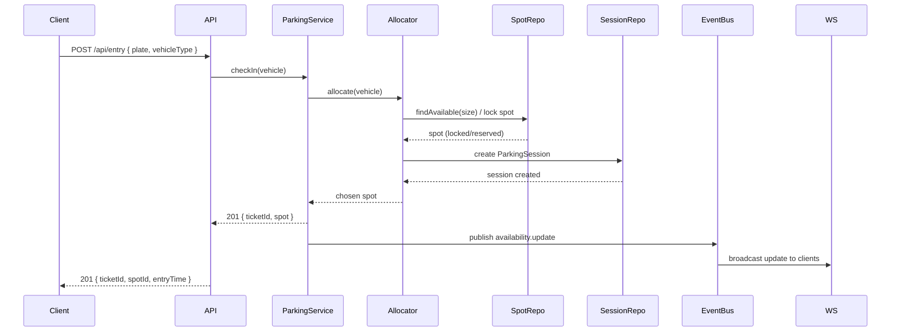
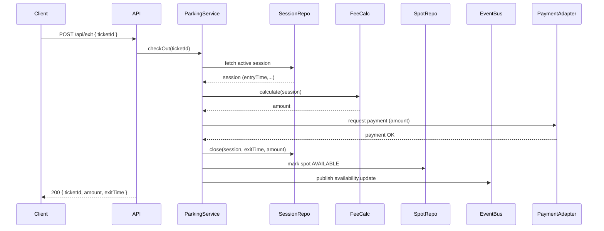
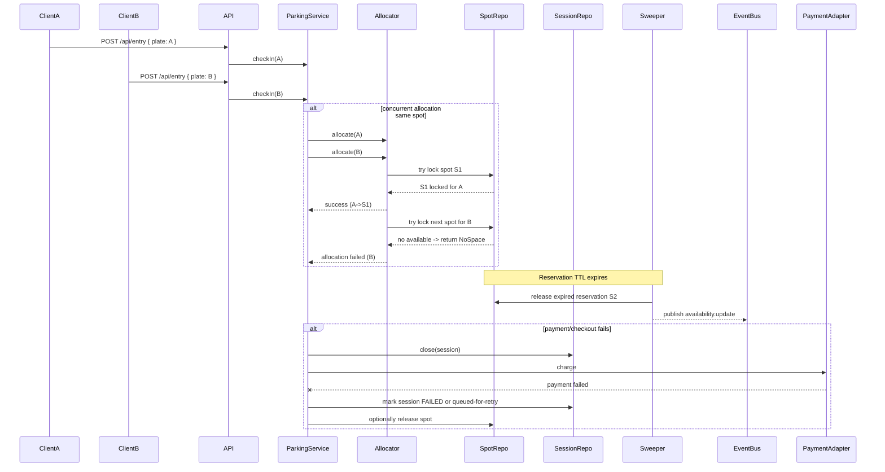

# Parking Lot System — Low-Level Design

A SOLID-driven, testable backend for a smart parking lot: spot allocation, entry/exit, fees, real-time availability. No DB or external infra required.

**Quick start**
- Install: `npm install`
- Demo: `npm run dev`
- Tests: `npm test`

---

## Goals
- **Functional:** allocate spots by vehicle size, track entry/exit, calculate fees, update availability in real-time.
- **Non-functional:** concurrent safety, low-latency, extensible fee/vehicle types, testable.
- **Vehicle types:** motorcycle, car, bus. **Storage:** UTC timestamps, configurable grace periods.

---

## Domain Model
**Entities:** ParkingLot → Floor → ParkingSpot, Vehicle, ParkingSession (entry/exit times + fee), Rate (per vehicle type), PaymentTransaction, Reservation (with TTL).

**Spot status:** AVAILABLE | RESERVED | OCCUPIED

---

## Database Schema (Key Tables)
```sql
CREATE TABLE parking_spot (id, floor_id, code, size, status, distance_rank);
CREATE TABLE vehicle (id, plate, type);
CREATE TABLE parking_session (id, vehicle_id, spot_id, entry_time, exit_time, billed_amount, version);
CREATE TABLE rate (id, vehicle_type, base_amount, per_hour, grace_period_minutes);
CREATE TABLE parking_reservation (id, spot_id, reserved_until, created_at);
```
**Indexes:** parking_spot(status, size, distance_rank), parking_session(status, vehicle_id), parking_reservation(reserved_until).

---

## Spot Allocation Algorithm
1. Map vehicle type → compatible spot sizes.
2. Query first AVAILABLE spot ordered by distance_rank (min-heap priority queue).
3. Lock spot atomically (DB transaction + SELECT FOR UPDATE).
4. Create session, mark spot OCCUPIED.
5. For buses: find contiguous segments (O(K) per lane).

**Complexity:** O(log N) per lookup.

---

## Fee Calculation (Strategy Pattern)
- `IFeeCalculator` interface with pluggable implementations (FlatPerHour, Tiered, etc.).
- Formula: `amount = base + ceil((duration_minutes - grace_minutes) / 60) * per_hour`.
- Rate policies stored in DB, fetched by vehicle type.

---

## Concurrency & Consistency
- **Allocation:** DB row-level lock (SELECT FOR UPDATE) within transaction to prevent double-allocation.
- **Updates:** Optimistic locking (version column) on ParkingSession.
- **High load:** Optional front-door queueing (Kafka/RabbitMQ) to serialize allocation.
- **Idempotency:** Check plate + active session before creating new session.

---

## APIs (REST)
- `POST /api/entry` { plate, vehicleType } → 201 { ticketId, spotId, entryTime }
- `POST /api/exit` { ticketId } → 200 { ticketId, amount, exitTime }
- `GET /api/spots/availability` → { total, available, bySize }
- `WS /ws/availability` — push availability updates (WebSocket/SSE)

---

## SOLID & Class Design
**Key interfaces:**
- `IParkingSpotAllocator` — allocate(vehicle): ParkingSpot
- `IFeeCalculator` — calculate(session): number
- `IParkingSpotRepository` — find/mark available/reserved
- `IParkingSessionRepository` — create/close sessions

**Classes:** SimpleAllocator, FlatPerHourCalculator, FeeCalculatorFactory, ParkingService (high-level coordinator).

**Follows:** SRP, OCP, LSP, ISP, DIP.

---

## Flows (High-Level)
**Entry:** Client → API.entry → Allocator.allocate → lock spot → create session → publish availability update

**Exit:** Client → API.exit → FeeCalculator.calculate → charge payment → close session → release spot → publish availability update

---

## Real-time Availability & Events
- **Pub/Sub:** Redis or Kafka publish `availability.update`, `session.created`, `session.closed` events.
- **WebSocket gateway** subscribes and broadcasts to clients.
- **Cache:** Redis for fast availability reads (eventual consistency acceptable).

---

## Testing & Observability
- **Unit tests:** allocator, fee calculator (Jest in `tests/`)
- **Integration tests:** DB transactions, concurrent allocation
- **Metrics:** allocation latency, success rate, occupancy, queue length
- **Logs:** structured with correlationId
- **Timezone:** Store UTC, convert on client. Use idempotency tokens for entry/exit (prevent duplicates).

---

## Edge Cases & Resilience
- **Concurrent arrivals:** DB locks or queueing serializes safely.
- **Reservation TTL:** background sweeper releases expired reservations (configurable, e.g., 5 min).
- **Partial failures:** compensating actions release spots, saga pattern for payment retries.
- **Lost ticket:** plate-based reconciliation lookup.
- **Payment failure:** retry or mark session for manual review.

---

## Future Enhancements
- Pre-booking / reservations with expiry
- Dynamic pricing (time-of-day, occupancy-based)
- Camera/ANPR integration for automated check-in
- Mobile push notifications, receipts

---

## Recommendations
1. Start with DB locking (SELECT FOR UPDATE); add distributed locks only if contention appears.
2. Keep fee calc pluggable and rate policies in DB.
3. Use Redis for fast availability reads + pub/sub for updates.
4. Add concurrency stress tests early.

---

## Sequence Diagrams 🧭

Below are the key sequence diagrams illustrating the typical flows and failure scenarios. The diagrams live under `diagrams/`.

- `diagrams/entry_sequence.mmd` — Entry flow (client -> allocate -> reserve -> create session -> publish availability).



- `diagrams/exit_sequence.mmd` — Exit flow (retrieve session -> calc fee -> charge -> close session -> release spot).



- `diagrams/failure_sequence.mmd` — Failure & concurrency scenarios (concurrent allocation attempts, reservation expiry, payment failure/compensation).



---

## File Structure
```
src/
  interfaces/ — allocator, feeCalculator contracts
  dtos/ — vehicle, session, paymentRequest
  services/ — simpleAllocator, flatFeeCalculator, feeCalculatorFactory, parkingService
  infra/ — inMemoryRepos (spotRepo, sessionRepo)
tests/
  allocator.test.ts
  feeCalculator.test.ts
diagrams/
  entry_sequence.mmd, exit_sequence.mmd, failure_sequence.mmd
DESIGN.md — full design reference
```

---

## Done ✅
- Low-level design with SOLID principles
- TypeScript skeleton (interfaces, DTOs, services)
- In-memory repositories
- Unit tests (Jest)
- Mermaid sequence diagrams (entry, exit, failure scenarios)
